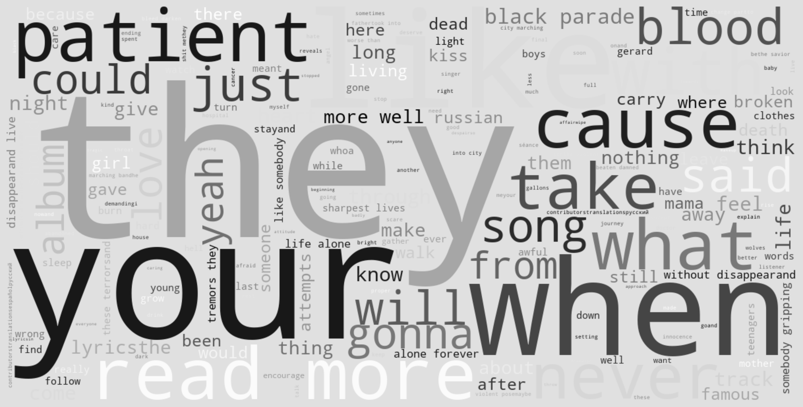
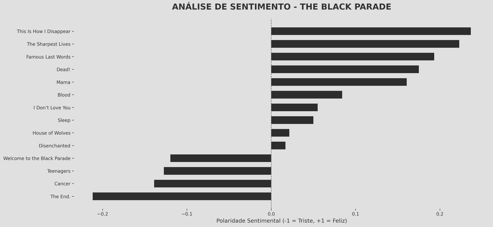

# 🎭 The Black Parade - Análise de Sentimentos

Este é meu primeiro projeto independente unindo ciência de dados e web design com uma obra que marcou minha adolescência: o álbum *The Black Parade*, da banda My Chemical Romance.

## 💡 Sobre o Projeto

O objetivo foi aplicar técnicas de análise textual para interpretar as letras do álbum sob uma perspectiva visual e emocional. A proposta vai além de estatísticas: ela busca traduzir sentimentos em dados acessíveis — explorando a relação entre palavras, temas e emoções presentes nas músicas.

> O álbum "The Black Parade" teve um grande impacto na minha vida, ainda adolescente, e escolhi ele como tema justamente por isso.

## 🔍 Funcionalidades

- 🎶 **Análise de Sentimentos**: Classifica cada música em uma escala emocional.
- ☁️ **Word Cloud**: Mostra visualmente as palavras mais frequentes nas letras.
- 🖥️ **Página Web Temática**: Estilização inspirada na estética dark do álbum.
- 👻 **Efeito Ghost Text**: Elementos decorativos com nomes de faixas no fundo da tela.

## 🧪 Tecnologias Utilizadas

- `Python`: BeautifulSoup, TextBlob, WordCloud
- `HTML5`, `CSS3`, `Bootstrap 5`
- `GitHub Pages` para deploy

## 📸 Preview do Projeto

🔗 Acesse aqui:  
[https://maluairesp.github.io/black-parade-analysis/](https://maluairesp.github.io/black-parade-analysis/)




## 📁 Estrutura de Arquivos

```
📂 black-parade-analysis/
├── index.html
├── style.css
├── mcr_wordcloud.png
├── mcr_sentiment.png
├── analise_sentimentos_mcr.py
└── README.md
```

## 👩‍💻 Sobre Mim

Me chamo **Maria Luiza**, sou estudante de Análise e Desenvolvimento de Sistemas. Este projeto é uma expressão pessoal e técnica, conectando minha paixão por música com meu aprendizado em tecnologia.

- [LinkedIn](https://www.linkedin.com/in/maria-luiza-peixoto-b54491187/)
- [GitHub](https://github.com/maluairesp)

---

🖤 Projeto desenvolvido com carinho — por alguém que cresceu ouvindo “Welcome to the Black Parade”.